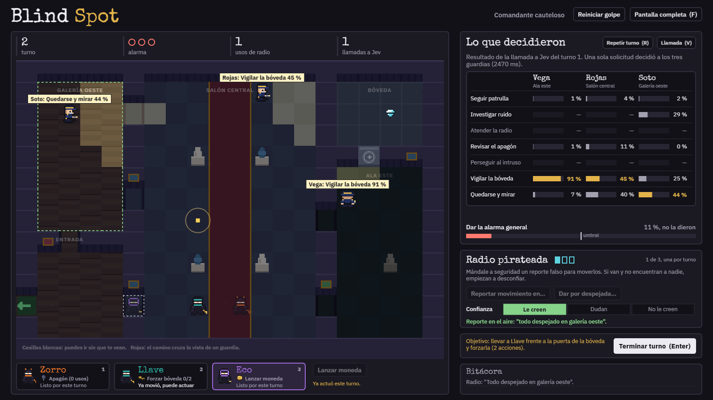

# Blind Spot

Juego táctico por turnos en pixel art: tu equipo entra de noche a un museo para robar el diamante. Los
guardias los controla **Jev** (TypeSafe AI): al final de cada turno tuyo, una sola llamada decide qué hace
cada guardia. El código calcula visión, caminos y distancias; Jev solo elige.



*Turno 2 contra el comandante cauteloso, con `SAMPLING=argmax` (cada guardia toma su opción más probable). En
el tablero: la moneda de Eco sonando en el salón central, el ala este a oscuras por el apagón de Zorro y la
radio dando por despejada la galería oeste. A la derecha, lo que Jev decidió en el turno 1, con una moneda, un
apagón y un reporte de radio a la vez: el cauteloso casi no les hizo caso y repartió entre vigilar la bóveda y
quedarse mirando. Una raya (—) es una opción que ese guardia no tenía ese turno.*

## Requisitos

- Node **20.19** o más nuevo.
- Opcional: una key del [AI Gateway de Vercel](https://vercel.com/ai-gateway) para jugar contra Jev de verdad.
  Sin key se juega igual contra el modo simulado (mock).

## Levantarlo

```bash
npm install
cp .env.example .env      # en Windows (PowerShell): Copy-Item .env.example .env
npm run dev
```

Abre <http://localhost:5173>. `npm run dev` levanta Vite (5173) y el servidor (8787) a la vez, y necesita que
exista `.env` aunque esté sin completar.

### Modos de los guardias (`JEV_MODE` en `.env`)

| Modo | Qué hace | Necesita key |
| --- | --- | --- |
| `mock` (por defecto) | Heurística local, gratis | No |
| `real` | Decide Jev a través del gateway (~$0.00006 por turno) | Sí, en `AI_GATEWAY_API_KEY` |
| `replay` | Repite respuestas grabadas en `logs/` | No |

Para `real`, completa `AI_GATEWAY_API_KEY` y comprueba la conexión con `npm run jev:ping`. Las demás variables
de `.env.example` tienen valores por defecto que sirven tal cual.

### Cómo elige cada guardia (`SAMPLING` en `.env`)

Jev no devuelve una sola respuesta: para cada guardia da una probabilidad por opción. El servidor sortea con
esas probabilidades, como una ruleta donde cada opción ocupa su porcentaje. Si Vega tiene *vigilar la bóveda*
90 % y *quedarse y mirar* 8 %, casi siempre vigila, pero más o menos una vez de cada doce se queda. Por eso a
veces un guardia hace algo poco probable: sin el sorteo serían predecibles y bastaría aprender qué los mueve.

El sorteo usa la semilla, el turno y el guardia: la misma partida con las mismas jugadas sortea lo mismo. La
alarma general no se sortea: cuenta solo si Jev le da 50 % o más.

| Modo | Qué hace |
| --- | --- |
| `sample` (por defecto) | Sortea con las probabilidades de Jev: un 8 % sale 8 de cada 100 veces |
| `argmax` | Siempre la opción más probable: guardias predecibles |

## Cómo se juega

1. Elige al comandante de seguridad: **cauteloso**, **impulsivo** o **rencoroso**. Todos usan el mismo código;
   solo cambia la doctrina que lee Jev.
2. En tu turno mueve a cada ladrón (clic en una casilla) y usa sus habilidades:
   - **Zorro** (mueve 5): *apagón*, deja una sala a oscuras hasta el final del turno enemigo (2 usos).
   - **Llave** (mueve 4): la única que puede forzar la puerta de la bóveda.
   - **Eco** (mueve 4): lanza una moneda para distraer a los guardias con el ruido.
   - **Radio pirateada** (3 usos): reporta movimiento en una sala o dala por despejada. Si la mentira se
     descubre, seguridad deja de creerle.
3. Termina el turno y mira qué decidió cada guardia. Jev da una probabilidad por opción y el código sortea con
   ellas, así que a veces sale una poco probable.

**Ganas** si el ladrón que lleva el diamante llega a la salida. **Pierdes** si la alarma llega a 3 (cada ladrón
visto la sube), si atrapan a quien lleva el diamante o si atrapan a todo el equipo.

### Teclas

| Tecla | Acción |
| --- | --- |
| `1` `2` `3` | Elegir ladrón |
| `Esc` | Cancelar la acción |
| `Enter` | Terminar el turno |
| `R` | Repetir el turno enemigo |
| `V` | Ver la llamada completa a Jev |
| `F` | Pantalla completa |

`http://localhost:5173/?commander=impulsivo&seed=123` saltea el menú; con la misma semilla y las mismas
jugadas se repite la misma partida.

## Otros comandos

```bash
npm test            # pruebas de reglas, del turno del servidor y de la política ante 429
npm run typecheck   # TypeScript estricto en shared, cliente y servidor
npm run bench       # banco de situaciones (mock); con -- --real usa Jev (~$0.0007)
```

Arquitectura, reglas completas y flujo de un turno: [ARCHITECTURE.md](ARCHITECTURE.md).
